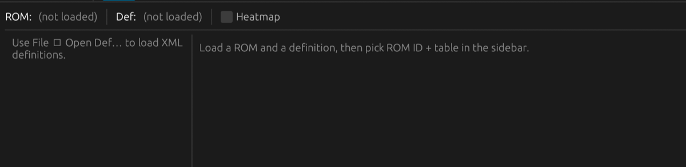
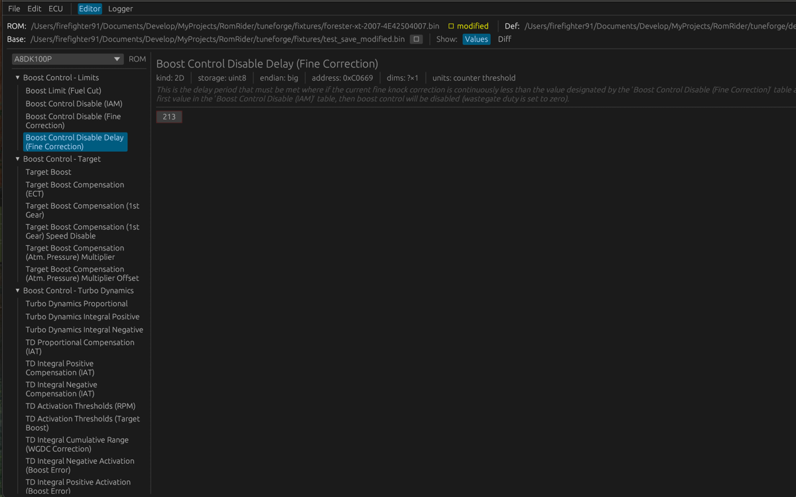
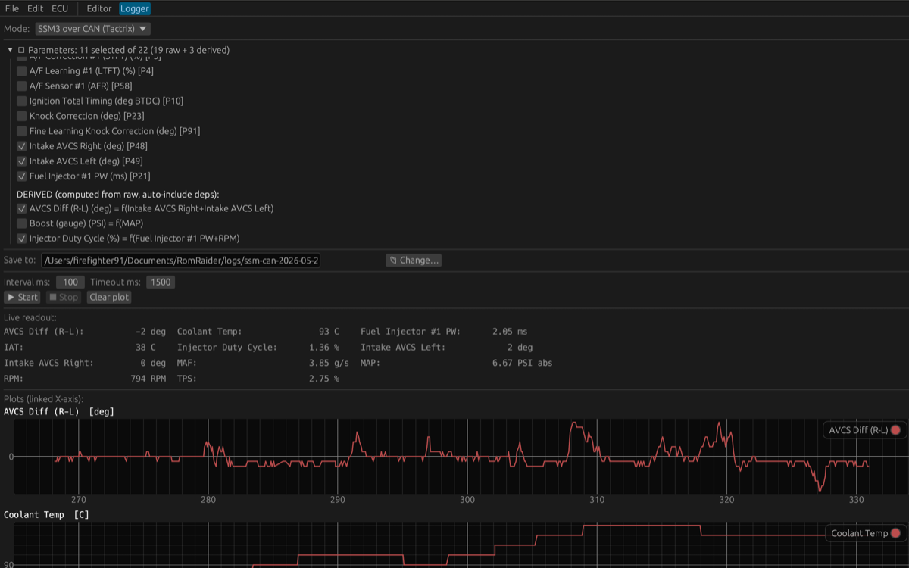
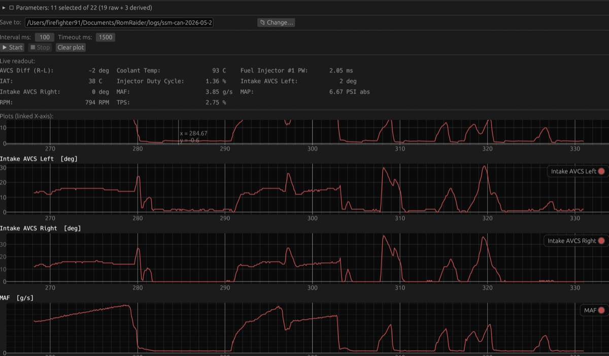
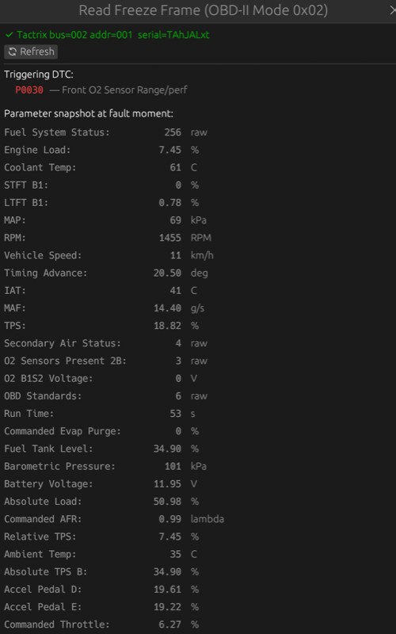
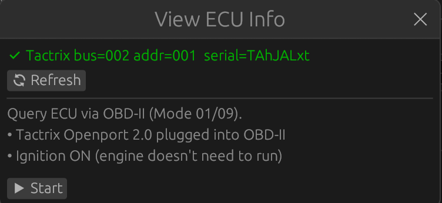
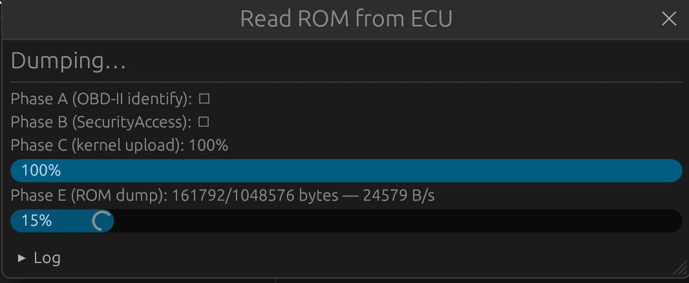
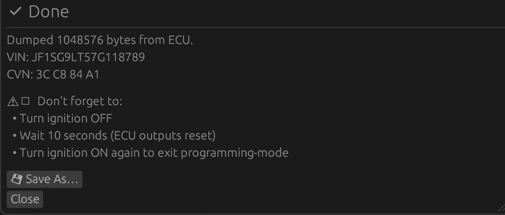

# tuneforge

[](https://github.com/firefighter-19/tuneforge/actions/workflows/ci.yml)
[](LICENSE)
[](https://www.rust-lang.org/)

**Languages:** [English](README.md) · **Русский**

**Mac-native Rust-инструмент для тюнинга Subaru ECU: редактор прошивок +
логгер + ROM-dump через Tactrix Openport 2.0, всё в одном бинарнике.**

Объединяет в одном приложении две вещи, для которых на Mac исторически
приходилось держать Windows-VM:

- **Редактор + логгер в духе [RomRaider](https://github.com/RomRaider/RomRaider)**
  (Java-приложение, ломаное на 64-bit OS) — открыть `.bin`, поправить таблицы
  по `ecu_defs.xml`, починить checksum, посмотреть/сравнить ROM-ы, поснимать
  лог по SSM2.
- **Dump ROM в духе [EcuFlash](https://www.tactrix.com/index.php?Itemid=58)**
  (freeware от Tactrix, тоже Windows-only) — снять полный 1 МБ образ с ECU
  через kernel-upload по UDS-over-CAN. Реализовано целиком на Rust, без
  J2534-DLL и без эмуляции.

> **Это производная работа.** RomRaider — open-source проект сообщества
> RomRaider.com с 2006 года, под GNU GPL v2.0+. EcuFlash — freeware от
> Tactrix; код её мы не используем, но функционально воспроизводим dump-flow
> (UDS sequence, seed/key, encrypted kernel) на основе reverse-engineering-а
> capture-ов EcuFlash-сессий. Этот репозиторий распространяется под GPL v2.0+
> (модуль `tuneforge-kernel` — под GPL v3.0+, изолированно). См.
> [Происхождение и лицензия](#происхождение-и-лицензия).

## Скриншоты

> Снято на живой машине (2007 USDM Forester XT, ROM `4E42504007`,
> Tactrix Openport 2.0 на Mac M1).

**ROM-редактор** — heatmap, подсветка изменённых ячеек, tooltip с raw/real/Δ:



| Compare ROMs (current vs baseline) | Live SSM3-CAN логгер — engine view |
|---|---|
|  |  |

| Live SSM3-CAN логгер — AVCS / boost view | Freeze Frame (Mode 02) — параметры на момент fault-а |
|---|---|
|  |  |

**Read ROM через UDS-over-CAN** — multi-phase progress: OBD-II identify →
SecurityAccess seed/key → encrypted kernel upload → ROM dump loop (~44 с целиком):

| Phase A+B | Phase C | Phase E (done) |
|---|---|---|
|  |  |  |

## Для чего это нужно

Mac-native инструмента для тюнинга Subaru не существовало. RomRaider (Java)
не работает на macOS, EcuFlash — Windows-only freeware. Любая
альтернатива требовала Windows VM или Wine с J2534 DLL — ничего из этого
я не хотел между Mac-ом и ECU.

Нативный USB-драйвер Tactrix (rusb, без J2534 DLL),
binary protocol stack (SSM2 / SSM3-CAN / OBD-II / UDS), reverse-engineered
криптография (Subaru seed/key — Feistel cipher с round-keys которые
живут в самой прошивке, извлечены из Wireshark capture-ов EcuFlash-сессий)
и immediate-mode GUI на `egui` — всё в одном Cargo workspace.

## Установка

**Runtime зависимость:** [`libusb`](https://libusb.info/) — на macOS:

```bash
brew install libusb
```

### Pre-built бинари (рекомендуется, macOS ARM + x86)

Собираются и публикуются через [`cargo-dist`](https://opensource.axo.dev/cargo-dist/)
в [GitHub Releases](https://github.com/firefighter-19/tuneforge/releases/latest).
В каждом релизе — `tuneforge` (CLI с полной kernel-upload функциональностью)
и `tuneforge-gui` (editor + logger + ECU-tools panel).

```bash
# CLI:
curl --proto '=https' --tlsv1.2 -LsSf \
    https://github.com/firefighter-19/tuneforge/releases/latest/download/tuneforge-cli-installer.sh | sh

# GUI:
curl --proto '=https' --tlsv1.2 -LsSf \
    https://github.com/firefighter-19/tuneforge/releases/latest/download/tuneforge-gui-installer.sh | sh
```

Бинари будут в `~/.cargo/bin/` (или там куда `cargo` обычно складывает) —
`tuneforge` (CLI) и `tuneforge-gui` (desktop приложение).

### Из исходников (любая платформа с Rust toolchain)

Требуется Rust stable 1.78+. Компиляция ~2 мин на M1.

```bash
# Headless CLI:
cargo install --git https://github.com/firefighter-19/tuneforge tuneforge-cli

# CLI + ROM dump через CAN (opt-in GPL-3.0 kernel-upload):
cargo install --git https://github.com/firefighter-19/tuneforge tuneforge-cli \
    --features kernel-upload

# GUI редактор + логгер:
cargo install --git https://github.com/firefighter-19/tuneforge tuneforge-gui

# GUI + ECU-tools panel (модалки Read ROM / DTC / Freeze Frame):
cargo install --git https://github.com/firefighter-19/tuneforge tuneforge-gui \
    --features ecu-tools
```

### macOS sudo note для работы с железом

Tactrix Openport требует `sudo` для libusb bulk-доступа (ограничение
macOS — unclaimed USB-устройства без kext-а нужны root-права):

```bash
sudo tuneforge ssm-init --tactrix
sudo tuneforge dump-rom-can --output ./dump.bin
sudo tuneforge-gui  # только если будешь юзать ECU-tools модалки
```

Homebrew tap (`brew install firefighter-19/tap/tuneforge`) — планируется в v0.5.0+.

## Быстрый старт

После установки headless CLI содержит ~20 subcommand-ов. Самые частые:

```bash
# Probe ECU — проверка железа, печать ROM ID + capability bitmap
sudo tuneforge ssm-init --tactrix

# OBD-II identifiers — VIN + CVN (без security access)
sudo tuneforge peek-vin
sudo tuneforge peek-cvn

# Diagnostic Trouble Codes (Mode 03/07/0A) с SAE-J2012 описаниями
sudo tuneforge dtc-can

# Freeze Frame (Mode 02) — snapshot параметров на момент fault-а
sudo tuneforge freeze-frame-can

# Live SSM3-CAN logger — Subaru tuner-grade params (knock, AVCS, AFR, boost)
sudo tuneforge logger-ssm-can --all --out "./drive-$(date +%F).csv"

# Полный 1 МБ ROM-dump через UDS-over-CAN + kernel-upload
sudo tuneforge dump-rom-can --output ./my-rom.bin

# Headless ROM-инспекция — значения таблиц + оси, без GUI
tuneforge inspect-def ./ecu_defs.xml --resolve --rom A8DK100P
tuneforge read-table ./rom.bin --def ./ecu_defs.xml --rom-id A8DK100P \
    --table "Target Boost A"

# Открыть desktop-приложение
sudo tuneforge-gui  # sudo нужен только если будешь юзать ECU-tools panel
```

`tuneforge --help` показывает все subcommand-ы; `tuneforge <cmd> --help` — флаги конкретной команды.

## Что работает прямо сейчас

Подтверждено на живой машине (2007 USDM Subaru Forester XT, ROM `4E42504007`,
Tactrix Openport 2.0 на Mac ARM):

- ✅ **SSM2 ECU-init по K-Line** через `tuneforge-cli ssm-init --tactrix`
- ✅ **GUI-редактор**: открыть `forester-xt-2007-4E42504007.bin` + `ecu_defs.xml`,
  отредактировать Target Boost / Wastegate Duty, авто-fix checksum, Save As;
  diff двух ROM-ов с heatmap, undo/redo, Changes-since-open, tooltip с raw/Δ
- ✅ **Headless-инспекция** ROM-ов и определений (`inspect-def`, `read-table`)
- ✅ **SSM-логгер** с резолвом `log_defs.xml`, live XY-plot в GUI
- ✅ **Полный 1 МБ ROM-dump через UDS-over-CAN** за ~44 с — byte-for-byte
  совпадает с дампом EcuFlash:
  ```bash
  sudo cargo run -p tuneforge-cli --features kernel-upload -- \
      dump-rom-can --output /tmp/forester-mac-dump.bin
  ```

## Что **не** делает (и пока не будет)

- ❌ **Flash-write в ECU**. Это explicit non-goal. У меня нет donor-ECU; риск кирпича превышает пользу. Если когда-то и появится — только на доноре. Kernel-upload пишет **только в RAM**, никакого flash-erase/program.
- ❌ **Не-Subaru ECU.** Эталон — Java-RomRaider, тестовая машина — Subaru.
- ❌ **Windows-only paths** (J2534 DLL-emulation, Wine, x86-USB-passthrough)
  — нам интересен именно Mac-native поток.

См. [`PROGRESS.md`](PROGRESS.md) для полной картины + roadmap по слайсам.

## Структура воркспейса

| Crate                | Назначение                                                              |
| -------------------- | ----------------------------------------------------------------------- |
| `tuneforge-core`     | Общие типы: адреса, endian, ошибки, утилиты для байтов                  |
| `tuneforge-io`       | Транспорты: serial, J2534, ELM327, **Tactrix Openport 2.0 (rusb, K-Line + CAN)** |
| `tuneforge-protocol` | Диалекты: SSM, OBD-II, DS2, NCS, RamTune                                 |
| `tuneforge-defs`     | Парсер XML-определений ECU и логгера                                     |
| `tuneforge-rom`      | Образ ROM, таблицы 1D/2D/3D, scaling/формулы, патчер контрольных сумм    |
| `tuneforge-logger`   | Backend логгера, подписки, datalog-файлы, внешние датчики                |
| `tuneforge-cli`      | Headless CLI — отладка, smoke-test, **dump-rom, ssm-init, peek-vin** и т.п. |
| `tuneforge-gui`      | GUI на `eframe`/`egui` (редактор + логгер + diff/heatmap/undo/changes)   |
| `tuneforge-kernel`   | (opt-in, GPL-3.0) Subaru SH7058 kernel-upload + UDS-over-CAN dump-flow   |

## Разработка

```bash
git clone https://github.com/firefighter-19/tuneforge && cd tuneforge
cargo build --workspace                                                  # default features
cargo build --workspace --features tuneforge-cli/kernel-upload,tuneforge-gui/ecu-tools
cargo test  --workspace                                                  # 220+ тестов
cargo clippy --workspace --all-targets -- -D warnings                    # CI gate
cargo fmt --all --check                                                  # CI gate
```

`--features kernel-upload` подключает crate `tuneforge-kernel` (GPL-3.0)
к CLI; `--features ecu-tools` — к GUI. Оба отключены по умолчанию —
workspace остаётся под GPL-2.0+ если этот код не используется.

## Совместимость с оригиналом

* XML-определения ECU (`definitions/`, `customize/`, `i18n/` в апстриме)
  **не модифицируются** и подключаются как есть — это самая ценная часть
  оригинального проекта, накопленная сообществом за 15+ лет.
* Логика протоколов сверяется с `com.romraider.io.protocol.*` из апстрима
  и тестируется на захваченных дампах коммуникаций.
* Алгоритмы checksum копируются из `com.romraider.maps.checksum.*` один в один
  и покрываются юнит-тестами.

## Дорожная карта

См. [`docs/ARCHITECTURE.md`](docs/ARCHITECTURE.md).

## Происхождение и лицензия

Этот проект — производная работа от [RomRaider](https://github.com/RomRaider/RomRaider).
Авторские права на оригинальный код принадлежат разработчикам RomRaider.com
(`Copyright (C) 2006-2022 RomRaider.com` — см. заголовки исходников апстрима).
Условия распространения совпадают с оригиналом: **GNU GPL версии 2 или новее**.

**Отдельно — crate `tuneforge-kernel`** (kernel-upload и UDS-dump): под **GPL v3.0+**,
поскольку использует наработки от GPL-3 проектов
([`fenugrec/nisprog`](https://github.com/fenugrec/nisprog),
[`fenugrec/npkern`](https://github.com/fenugrec/npkern)).
Crate изолирован за feature-flag-ом `kernel-upload`, остальные крейты остаются
под GPL-2.0+.

**О EcuFlash:** мы не используем её код (EcuFlash — freeware от Tactrix, не
open-source). Dump-flow реализован независимо: reverse-engineering Wireshark-
capture-ов EcuFlash-сессий + публичные ресурсы (nisprog/npkern + работа
[james-portman](https://github.com/james-portman/subaru-ecu-flashing)).
Encrypted kernel-binary, который мы загружаем в RAM ECU, изначально пришёл с
OpenECU/Tactrix (`OpenECU Subaru SH7058 OCP CAN Kernel V1.07`); он
переиспользуется как-есть из capture, поскольку контракт между ECU и kernel-ом
жёстко зашит в bootloader. Если правообладатель сочтёт это проблемой —
напишите issue, удалим бинарник и оставим только инструкции «вытащите свой».

Полный текст лицензии — в [`LICENSE`](LICENSE).

Если вы используете определения, словари переменных или checksum-алгоритмы
из апстрим-репозитория RomRaider — обязательно сохраняйте указание авторства
и условий лицензии при дальнейшем распространении.

## Безопасность и предупреждение

Этот инструмент **читает** прошивку и редактирует **файлы на диске**. Он
**не пишет ничего обратно в ECU** — flash-write не реализован и реализован
не будет без donor-ECU для тестов. Тем не менее, при работе с тюнингом ECU
любая ошибка может привести к нестабильной работе двигателя или его
повреждению. Используйте на свой страх и риск; авторы не несут
ответственности за повреждение оборудования или двигателя.
